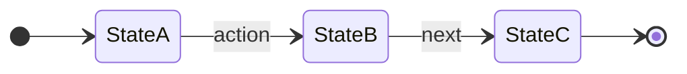

  
Category

  <h1>Main Title Goes Here</h1>
  
One or two sentences establishing the core claim.

---

Section Label

## Concrete Heading That Carries the Point

<ul class="tight-list">
  <li>First key point</li>
  <li>Second key point</li>
  <li>Third key point</li>
</ul>

<ul class="tight-list">
  <li>Supporting detail or second angle</li>
  <li>Another supporting point</li>
</ul>

---

Architecture

## Slide With a Mermaid Diagram

<ul class="tight-list">
  <li>Explain what the diagram shows</li>
  <li>Call out the key transition</li>
  <li>Note the terminal state</li>
</ul>

---

Features

## Slide With Pills and Chips

<ul class="tight-list">
  <li>Feature description one</li>
  <li>Feature description two</li>
  <li>Feature description three</li>
</ul>

<strong>ENUM_NAME</strong>

  value_one
  value_two
  value_three
  value_four

---

Impact

## Three-Column Metrics Slide

<strong>Metric A ↑</strong>

<ul class="mini-list">
  <li>Reason one</li>
  <li>Reason two</li>
</ul>

<strong>Metric B ↓</strong>

<ul class="mini-list">
  <li>Reason one</li>
  <li>Reason two</li>
</ul>

<strong>Metric C ↑</strong>

<ul class="mini-list">
  <li>Reason one</li>
  <li>Reason two</li>
</ul>

